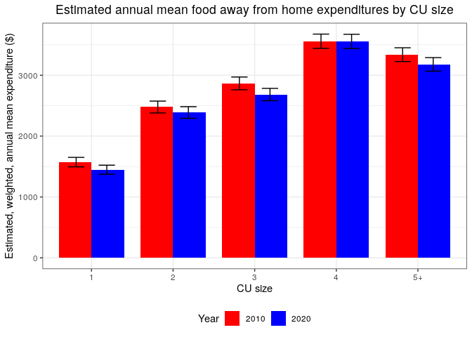
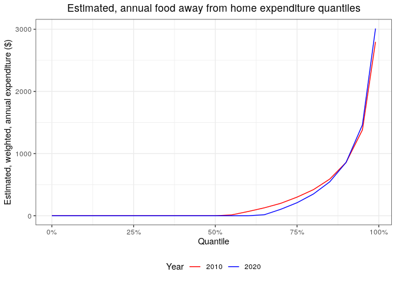

[](https://travis-ci.com/arcenis-r/cepumd)
[](https://codecov.io/gh/arcenis-r/cepumd)

<!-- README.md is generated from README.Rmd. Please edit that file -->

# cepumd

`cepumd` facilitates the calculation of Consumer Expenditure Survey (CE)
annual, weighted, estimated mean expenditures using CE Public-Use
Microdata (PUMD) by addressing some unique challenges that exist in
working with CE PUMD. Some examples are:

- Downloading CE PUMD from within R
- Converting hierarchical grouping (HG) files to data tables
- Accounting for the factor (annual vs. quarterly expenditure)
- Accounting for the “months in scope” of a given consumer unit (CU)
- Annualizing expenditures for either Diary or Interview expenditures
- Integrating Interview and Diary data as necessary
- Calculating weighted CE quantiles

For more information on the CE, please visit <https://www.bls.gov/cex/>.

The workhorse of is `ce_prepdata()`. It merges the household
characteristics file (FMLI/-D) with the corresponding expenditure
tabulation file (MTBI/EXPD) for a specified year, adjusts weights for
months-in-scope and the number of collection quarters, adjusts some cost
values by their periodicity factor (some cost categories are represented
as annual figures and others as quarterly). With the recent update it
only requires the first 3 arguments to function: the year, the survey
type, and one or more valid UCCs. `ce_prepdata()` now creates all of the
other necessary objects within the function if not provided.

There are three other functions that help the user download and wrangle
the data and necessary documentation, such as the HG files:

- `ce_download()` downloads zip files for a given year and survey
  instrument directly from the CE website
- `ce_hg()` pulls the requested type of HG file (Interview, Diary, or
  Integrated) for a specified year.
- `ce_uccs()` filters the HG file for the specified expenditure category
  and returns either a data frame with only that section of the HG file
  or the Universal Classification Codes (UCCs) that make up that
  expenditure category.

There are two functions that the user can use to calculate CE summary
statistics:

- `ce_mean()` calculates a mean expenditure, standard error of the mean,
  coefficient of variation, and an aggregate expenditure.
- `ce_quantiles()` calculates weighted expenditure quantiles. It is
  important to note that calculating means for integrated expenditures
  is not recommended because the calculation involves using weights from
  both the Diary and Survey instruments.

There are two functions that allow the user to download metadata that
can be useful in preparing data:

- `store_ce_hg()` downloads the zip file containing all HG files
  maintained by the CE to the specified location.
- `store_ce_dict()` downloades the CE PUMD dictionary from CE’s website
  to the specified location.

Finally, there are two utility functions to make the workflow a bit
easier:

- `ce_pumd_years()` scrapes the main PUMD website to get a vector of
  years for which PUMD are available. The vector is limited to the years
  for which there are also HG files available.
- `ce_cleanup()` deletes a file containing CE data that may only be
  necessary temporarily.

## Updates

Due to changes in the way CE PUMD stores their data starting with the
2020 PUMD I revisited the way that the main functions of stores and
accesses files locally. The main overarching change is that all files
are expected to be stored in one directory. To that end, if a directory
is not provided to the functions, one will be created in the local
temporary directory. Also, the most of the functions used for
downloading or preparing data now take a argument to help with this. The
major benefit of this change is that all files are now in one place and
can be quickly cleaned up. An ancillary benefit is that it can make the
workflow much simpler for quickly getting an expenditure estimate.

## Word of caution

The CE PUMD is a wonderfully rich dataset that can provide all manner of
insight into how Americans spend money, but there are some strict
limitations with respect to the types of analyses that can be done with
this data. One of the more common violations of sound statistical
methodology that I’m aware of is trying to calculate annual expenditure
means for subgroups that are defined by variables that were not used in
the sample design, i.e., the weights. The best advice that I can give is
that users of this package (or anyone using CE PUMD to estimate annual
expenditures) is to stick to the same classifications used by the CE in
their published tables ([](https://www.bls.gov/cex/tables.htm)). I’ll
also point users of this package to the [CE PUMD Getting Started
Guide](https://www.bls.gov/cex/tables.htm).

## Installation

You can install the development version of `cepumd` from
[GitHub](https://github.com) with:

``` r
devtools::install_github("/arcenis-r/cepumd")
```

## Prep work

The first step is to load the necessary packages into the environment.

``` r

# Store a vector of names of additional packages to be used
pkgs <- c("tidyverse", "devtools", "rlang", "readxl", "knitr")

# Install packages from CRAN
invisible(
  sapply(
    pkgs, function(x) if (!x %in% installed.packages()) install.packages(x)
  )
)

# Load 'cepumd' and 'tidyverse' to the workspace
library(knitr)
library(readxl)
library(cepumd)
library(tidyverse)
```

## Example Workflow 1

The following is an example of how someone might go about using `cepumd`
to calculate a 2021 annual, weighted estimate of mean expenditures on
pets for all of the U.S. using CE integrated data without creating a
separate directory for the data. This is just a quick and easy
calculation.

``` r
ex1 <- ce_prepdata(
  2021,
  integrated,
  uccs = ce_hg(2021, integrated) %>% ce_uccs("Pets")
) %>%
  ce_mean() %>%
  kable(booktabs = TRUE)
```

Yup… that’s all it takes. I simply ran `ce_prepdata()` with the year,
the survey type, and the uccs I needed and piped that directly into
`ce_mean()`.

But where are all the files? Zip files, etc.? They’re in my R session’s
temporary directory under a sub-directory named “ce-data”.

``` r
list.files(file.path(tempdir(), "ce-data"))
#> [1] "ce-stubs.zip" "diary21"      "diary21.zip"  "intrvw20"     "intrvw20.zip"
#> [6] "intrvw21"     "intrvw21.zip"
```

I’ll go ahead and clean those files up really quickly.

``` r
ce_cleanup()
list.files(file.path(tempdir(), "ce-data"))
#> character(0)
```

This works because if `ce_cleanup()` isn’t given a directory to clean up
it looks R’s temporary directory for a subdirectory called “ce-data”. If
it doesn’t find that AND it gets no other directory to look in, it
returns a message saying there’s nothing to clean up.

We saw the mean in the last example, but getting the annual, weighted
estimate of the median would be just as easy.

``` r
ce_prepdata(
  2021,
  integrated,
  uccs = ce_hg(2021, integrated) %>% ce_uccs("Pets")
) %>%
  ce_quantiles() %>%
  kable(booktabs = TRUE)
```

| probs | quantile |
|:------|---------:|
| 50%   |        0 |

``` r

ce_cleanup()
```

## Example Workflow 2

In this example I’ll calculate estimated annual expenditures on used
cars and trucks by urbanicity also for 2021. I already know that the
title of that expenditure category in the HG files is “Cars and trucks,
used” and the UCCs are 460110 for used cars and 460901 for used trucks.
I also know that all of these data are collected through the interview
survey, so I’ll use the interview data only. Now here’s a wrinkle:
because I’m going to add a grouping variable (“BLS_URBN”), I do need to
specify all of the other named arguments. This is due to the developer’s
inexperience with using missing arguments (if anyone can help me out
with this, I would greatly appreciate it). Once the data are prepped
with `ce_data()` I’ll just nest the data by urbanicity and run
`ce_means()` on the nested datasets.

``` r
ce_prepdata(
  2021,
  interview,
  uccs = c("460110", "460901"),
  recode_variables = TRUE,
  ce_dir = NULL,
  dict_path = NULL,
  int_zp = NULL,
  dia_zp = NULL,
  hg = NULL,
  bls_urbn
) %>%
  nest(data = -bls_urbn) %>%
  mutate(ce_mn_df = map(data, ce_mean)) %>% 
  select(-data) %>% 
  unnest(ce_mn_df) %>%
  kable(booktabs = TRUE)
```

| bls_urbn |      agg_exp | mean_exp |       se |       cv |
|:---------|-------------:|---------:|---------:|---------:|
| Urban    | 310383802180 | 2472.104 | 49.69722 | 2.010321 |
| Rural    |  30912654497 | 3844.600 | 61.73577 | 1.605779 |

``` r

ce_cleanup()
```

## Example Workflow 3

In this last example I’m going to assume very little knowledge about the
CE. I’d like to compare mean annual expenditures on food away from home
between 2010 and 2020 by household size. Also, I’m going to set up a
directory on my local machine to put all the data and metadata files
into.

First, I’ll set up that directory. I’ll put the directory path in a
variable called “food_away_dir” for simplicity.

``` r
food_away_dir <- file.path("..", "food-away")
dir.create(food_away_dir)
list.files(food_away_dir)
#>  [1] "ce-dict.xlsx" "ce-stubs.zip" "diary10"      "diary10.zip"  "diary20"     
#>  [6] "diary20.zip"  "intrvw10"     "intrvw10.zip" "intrvw19"     "intrvw19.zip"
#> [11] "intrvw20"     "intrvw20.zip"
```

Next, I want to make sure that there are data for my years of interest.

``` r
ce_pumd_years()
#>  [1] 2021 2020 2019 2018 2017 2016 2015 2014 2013 2012 2011 2010 2009 2008 2007
#> [16] 2006 2005 2004 2003 2002 2001 2000 1999 1998 1997
```

Now I want to store the CE HG files and data dictionary.

``` r
store_ce_hg(food_away_dir)
store_ce_dict(food_away_dir)
```

Let’s take a look at what the files are called.

``` r
list.files(food_away_dir)
#>  [1] "ce-dict.xlsx" "ce-stubs.zip" "diary10"      "diary10.zip"  "diary20"     
#>  [6] "diary20.zip"  "intrvw10"     "intrvw10.zip" "intrvw19"     "intrvw19.zip"
#> [11] "intrvw20"     "intrvw20.zip"
```

Next I want to see what the 2010 HG file looks like for 2010 for
expenditures on “food away from home”. First I’ll download both HG files
(2010 and 2020), then I’ll find the correct title in the 2010 HG file
for my category.

``` r
hg_10 <- ce_hg(2010, integrated, food_away_dir)
hg_20 <- ce_hg(2020, integrated, food_away_dir)
```

``` r
food_away_title <- hg_10 %>%
  filter(str_detect(title, "[F|f]ood [A|a]way")) %>%
  pull(title)

food_away_title
#> [1] "Food away from home"
```

Now I’ll use that title to get the UCCs and see the entire table with
“food away from home” expenditures for 2010

``` r
food_away_hg_10 <- ce_uccs(hg_10, food_away_title, uccs_only = FALSE)
food_away_hg_20 <- ce_uccs(hg_20, food_away_title, uccs_only = FALSE)

food_away_hg_10 %>% kable(booktabs = TRUE)
```

| level | title                                                                                                 | ucc      | survey | factor |
|:------|:------------------------------------------------------------------------------------------------------|:---------|:-------|:-------|
| 3     | Food away from home                                                                                   | FOODAWAY | G      | 1      |
| 4     | Meals at restaurants, carry outs and other                                                            | RESTCOAO | G      | 1      |
| 5     | Lunch                                                                                                 | LUNCH    | G      | 1      |
| 6     | Lunch at fast food, take-out, delivery, concession stands, buffet and cafeteria (other than employer  | 190111   | D      | 1      |
| 6     | Lunch at full service restaurants                                                                     | 190112   | D      | 1      |
| 6     | Lunch at vending machines and mobile vendors                                                          | 190113   | D      | 1      |
| 6     | Lunch at employer and school cafeterias                                                               | 190114   | D      | 1      |
| 5     | Dinner                                                                                                | DINNER   | G      | 1      |
| 6     | Dinner at fast food, take-out, delivery, concession stands, buffet and cafeteria (other than employer | 190211   | D      | 1      |
| 6     | Dinner at full service restaurants                                                                    | 190212   | D      | 1      |
| 6     | Dinner at vending machines and mobile vendors                                                         | 190213   | D      | 1      |
| 6     | Dinner at employer and school cafeterias                                                              | 190214   | D      | 1      |
| 5     | Snacks and nonalcoholic beverages                                                                     | SNKNABEV | G      | 1      |
| 6     | Snacks and nonalcoholic beverages at fast food, take-out, delivery, concession stands, buffet and     | 190311   | D      | 1      |
| 6     | Snacks and nonalcoholic beverages at full service restaurants                                         | 190312   | D      | 1      |
| 6     | Snacks and nonalcoholic beverages at vending machines and mobile vendors                              | 190313   | D      | 1      |
| 6     | Snacks and nonalcoholic beverages at employer and school cafeterias                                   | 190314   | D      | 1      |
| 5     | Breakfast and brunch                                                                                  | BRKFBRUN | G      | 1      |
| 6     | Breakfast and brunch at fast food, take-out, delivery, concession stands, buffet and cafeteria        | 190321   | D      | 1      |
| 6     | Breakfast and brunch at full service restaurants                                                      | 190322   | D      | 1      |
| 6     | Breakfast and brunch at vending machines and mobile vendors                                           | 190323   | D      | 1      |
| 6     | Breakfast and brunch at employer and school cafeterias                                                | 190324   | D      | 1      |
| 4     | Food or board at school                                                                               | 190901   | I      | 1      |
| 4     | Catered affairs                                                                                       | 190902   | I      | 1      |
| 4     | Food on out-of-town trips                                                                             | 190903   | I      | 1      |
| 4     | School lunches                                                                                        | 790430   | I      | 1      |
| 4     | Meals as pay                                                                                          | 800700   | I      | 1      |
| 2     | Alcoholic beverages                                                                                   | ALCBEVG  | G      | 1      |

Next I’ll use the dictionary to find the variable for household size.
First I’ll take a look at the sheets in the dictionary.

``` r
ce_dict_file_path <- file.path(food_away_dir, "ce-dict.xlsx")
excel_sheets(ce_dict_file_path)
#> [1] "Cover"     "Variables" "Codes "
```

Next I’ll see what variables contain anything about the number of
household members. To do that I’ll have to load the sheet from the
dictionary containing the variable definitions

``` r
ce_variables <- read_excel(ce_dict_file_path, sheet = "Variables")

ce_variables %>%
  filter(
    str_detect(File, "FMLI"), is.na(`Last year`),
    str_detect(
      tolower(`Variable description`), "number of members"
    )
  ) %>%
  kable(booktabs = TRUE)
```

| Survey    | File | Variable Name | Variable description                | Formula          | Flag name  | Section number | Section description                                                  | Section part | First year | First Quarter | Last quarter | Last year | Comment |
|:----------|:-----|:--------------|:------------------------------------|:-----------------|:-----------|:---------------|:---------------------------------------------------------------------|:-------------|-----------:|--------------:|-------------:|----------:|:--------|
| INTERVIEW | FMLI | AS_COMP5      | Number of members under age 2 in CU | COUNT (AGE \< 2) | AS_C\_MP5  | NA             | CU characteristics, income, weights, and summary level expenditures. | NA           |       1984 |             1 |           NA |        NA | NA      |
| INTERVIEW | FMLI | FAM_SIZE      | Number of Members in CU             | NA               | FAM\_\_IZE | NA             | CU characteristics, income, weights, and summary level expenditures. | NA           |       1984 |             1 |           NA |        NA | NA      |

It looks like FAM_SIZE Might be the variable. I’ll look at the full
description.

``` r
ce_variables %>%
  filter(
    `Variable Name` %in% "FAM_SIZE",
    str_detect(File, "FMLI"), is.na(`Last year`)
  ) %>%
  pull("Variable description")
#> [1] "Number of Members in CU"
```

Next I’ll check whether the FAM_SIZE variable has any value codes
associated with it. I’ll have to pull in the “Codes” sheet. (Check your
spelling here.)

``` r
ce_codes <- read_excel(ce_dict_file_path, sheet = "Codes ")

ce_codes %>%
  filter(File %in% "FMLI", Variable %in% "FAM_SIZE") %>%
  kable(booktabs = TRUE)
```

| Survey | File | Variable | Code value | Code description | First year | First quarter | Last year | Last quarter | Comment | …11 |
|:-------|:-----|:---------|:-----------|:-----------------|-----------:|--------------:|----------:|-------------:|:--------|:----|

It looks like FAM_SIZE is not a coded variable (no observations in the
“Codes” sheet). So I’m ready to prepare my data. The first thing I’ll
need are the UCCs for each of the two years in my analysis.

``` r
food_away_uccs_10 <- ce_uccs(food_away_hg_10, food_away_title, uccs_only = TRUE)
food_away_uccs_20 <- ce_uccs(food_away_hg_20, food_away_title, uccs_only = TRUE)

food_away_uccs_10
#>  [1] "190111" "190112" "190113" "190114" "190211" "190212" "190213" "190214"
#>  [9] "190311" "190312" "190313" "190314" "190321" "190322" "190323" "190324"
#> [17] "190901" "190902" "190903" "790430" "800700"
```

Next I’ll prepare the 2010 data and get a summary of the FAM_SIZE
variable since it is a continuous variable.

``` r
food_away_data_10 <- ce_prepdata(
  2010,
  integrated,
  food_away_uccs_10,
  recode_variables = FALSE,
  ce_dir = food_away_dir,
  dict_path = "ce-dict.xslx",
  int_zp = NULL,
  dia_zp = NULL,
  hg = food_away_hg_10,
  fam_size
)

summary(food_away_data_10$fam_size)
#>    Min. 1st Qu.  Median    Mean 3rd Qu.    Max. 
#>   1.000   1.000   2.000   2.592   4.000  14.000
```

Since some housholds have as many as 14 peopl, I’ll create a FAM_SIZE
label with any number greater than 4 taking on the value “5+” later on.
Next, I’ll prepare the 2020 data and rowbind it with the 2010 data as
well as create the fam_size_label variable. I’ll also go ahead and get
weighted, annual estimated means in one go.

``` r
food_away_data_20 <- ce_prepdata(
  2020,
  integrated,
  food_away_uccs_20,
  recode_variables = FALSE,
  ce_dir = food_away_dir,
  dict_path = "ce-dict.xslx",
  int_zp = NULL,
  dia_zp = NULL,
  hg = food_away_hg_20,
  fam_size
)

food_away_comp_data <- food_away_data_10 %>%
  mutate(year = 2010) %>%
  bind_rows(food_away_data_20 %>% mutate(year = 2020)) %>%
  mutate(
    fam_size_label = if_else(fam_size > 4, "5+", as.character(fam_size)),
    year = factor(year)
  ) %>%
  nest(data = -c(year, fam_size_label)) %>%
  mutate(ce_mn_df = map(data, ce_mean)) %>% 
  ungroup() %>%
  select(-data) %>% 
  unnest(ce_mn_df) %>%
  mutate(
    lower = mean_exp - (qnorm(0.975) * se),
    upper = mean_exp + (qnorm(0.975) * se)
  )

food_away_comp_data %>% kable(booktabs = TRUE)
```

| year | fam_size_label |      agg_exp | mean_exp |       se |       cv |    lower |    upper |
|:-----|:---------------|-------------:|---------:|---------:|---------:|---------:|---------:|
| 2010 | 2              |  97933894378 | 2477.569 | 49.74981 | 2.008009 | 2380.061 | 2575.077 |
| 2010 | 3              |  50395554564 | 2865.902 | 53.62464 | 1.871126 | 2760.799 | 2971.004 |
| 2010 | 1              |  55083803458 | 1572.640 | 39.59669 | 2.517848 | 1495.032 | 1650.248 |
| 2010 | 5+             |  43444179130 | 3337.577 | 57.81740 | 1.732317 | 3224.257 | 3450.897 |
| 2010 | 4              |  56019572596 | 3558.723 | 59.76521 | 1.679400 | 3441.585 | 3675.861 |
| 2020 | 1              |  56785595827 | 1448.125 | 37.83664 | 2.612801 | 1373.967 | 1522.284 |
| 2020 | 2              | 103761786275 | 2387.793 | 48.86163 | 2.046310 | 2292.026 | 2483.560 |
| 2020 | 4              |  58215175414 | 3555.463 | 59.70768 | 1.679322 | 3438.438 | 3672.488 |
| 2020 | 3              |  51769500538 | 2682.933 | 51.89517 | 1.934270 | 2581.220 | 2784.645 |
| 2020 | 5+             |  41476737207 | 3178.722 | 56.67492 | 1.782947 | 3067.641 | 3289.802 |

Plotting these data would be pretty straightforward, as well.

``` r
food_away_comp_data %>%
  ggplot(aes(x = fam_size_label, y = mean_exp, fill = year, group = year)) +
  geom_bar(stat = "identity", position = "dodge", width = 0.8) +
  geom_errorbar(
    aes(ymin = lower, ymax = upper),
    width = 0.4,
    position = position_dodge(0.75)
  ) +
  scale_fill_manual(values = c("red", "blue")) +
  labs(
    title =
      "Estimated annual mean food away from home expenditures by CU size",
    x = "CU size",
    y = "Estimated, weighted, annual mean expenditure ($)",
    fill = "Year"
  ) +
  theme_bw() +
  theme(plot.title = element_text(hjust = 0.5), legend.position = "bottom")
```



And that’s it. This analysis would give me the weighted, annual
estimated mean expenditures on food away from home by family size in
2010 and 2020. Now for a very quick comparison, I’ll take a quick look
at the median and 60th, 75th and 95th weighted, annual estimated
quantiles for the same years.

``` r
food_away_comp_quantiles <- food_away_data_10 %>%
  mutate(year = 2010) %>%
  bind_rows(food_away_data_20 %>% mutate(year = 2020)) %>%
  mutate(year = factor(year)) %>%
  group_by(year) %>%
  nest() %>%
  mutate(
    fa_qtile = map(data, ce_quantiles, probs = c(seq(0, 0.95, by = 0.05), 0.99))
  ) %>% 
  ungroup() %>%
  select(-data) %>% 
  unnest(fa_qtile) %>%
  mutate(probs = parse_number(probs) / 100)

food_away_comp_quantiles %>%
  ggplot(aes(x = probs, y = quantile, group = year, color = year)) +
  geom_line() +
  scale_color_manual(values = c("red", "blue")) +
  scale_x_continuous(labels = scales::percent) +
  labs(
    title =
      "Estimated, annual food away from home expenditure quantiles",
    x = "Quantile",
    y = "Estimated, weighted, annual expenditure ($)",
    color = "Year"
  ) +
  theme_bw() +
  theme(plot.title = element_text(hjust = 0.5), legend.position = "bottom")
```



``` r

ce_cleanup(food_away_dir)
```

There are a lot of 0-value reported expenditures in the CE on food away
from home. Unfortunately, I can’t perform an analysis using only
respondents that did have expenditures in this category, i.e., dropping
the 0’s, because whether someone had an expenditure on food away from
home is not one of the variables used for generating the survey weights.
In other words, the analysis can be done, but it would not be
statistically valid and I definitely wouldn’t be able to make any
inferences from it. This is my cautionary note to anyone using this
package who might use it in a way that is not statistically sound.
Please visit the [CE’s website](https://www.bls.gov/cex/) and read the
[CE PUMD Getting Started Guide](https://www.bls.gov/cex/tables.htm) for
more information.
