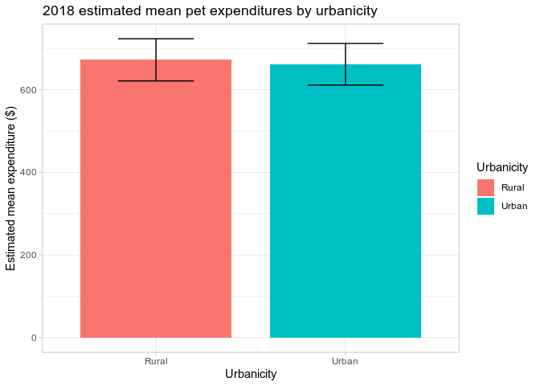

[](https://travis-ci.com/arcenis-r/cepumd)
[](https://codecov.io/gh/arcenis-r/cepumd?branch=master)

<!-- README.md is generated from README.Rmd. Please edit that file -->

# cepumd

`cepumd` facilitates the calculation of Consumer Expenditure Survey (CE)
annual, weighted, estimated mean expenditures using CE Public-Use
Microdata (PUMD) by addressing some unique challenges that exist in
working with CE PUMD. Some examples are:

  - Downloading CE PUMD from within R
  - Converting stub files to data tables
  - Accounting for the factor (annual vs. quarterly expenditure)
  - Accounting for the “months in scope” of a given consumer unit (CU)
  - Annualizing expenditures for either Diary or Interview expenditures
  - Integrating Interview and Diary data as necessary
  - Calculating weighted CE quantiles

There are 4 functions that help the user download and wrangle the data
and necessary documentation, such as the stub files:

  - `ce_download()` downloads zip files for a given year and survey
    instrument directly from the CE website
  - `ce_stub()` pulls the requested type of stub file (Interview, Diary,
    or Integrated) for a specified year.
  - `ce_uccs()` filters the stub file for the specified expenditure
    category and returns either a data frame with only that section of
    the stub file or the Universal Classification Codes (UCCs) that make
    up that expenditure category.
  - `ce_prepdata` merges the household characteristics file (FMLI/-D)
    with the corresponding expenditure tabulation file (MTBI/EXPD) for a
    specified year, adjusts weights for months-in-scope and the number
    of collection quarters, adjusts some cost values by their
    periodicity factor (some cost categories are represented as annual
    figures and others as quarterly).

There are 2 functions that the user can use to calculate CE summary
statistics:

  - `ce_mean()` calculates a mean expenditure, standard error of the
    mean, coefficient of variation, and an aggregate expenditure.

  - `ce_quantiles()` calculates weighted expenditure quantiles. It is
    important to note that calculating means for integrated expenditures
    is not recommended because the calculation involves using weights
    from both the Diary and Survey instruments.

## Installation

You can install the development version of `cepumd` from
[GitHub](https://github.com) with:

``` r
devtools::install_github("/arcenis-r/cepumd")
```

## Example Workflow

The following is an example of how someone might go about using `cepumd`
to calculate a 2017 annual, weighted estimate of mean expenditures on
pets using CE integrated data.

The first step is to load the necessary packages into the environment.

``` r

# Store a vector of names of packages to be used
pkgs <- c("dplyr", "tidyr", "purrr", "rlang", "ggplot2", "devtools")

# Install packages from CRAN
sapply(pkgs, function(x) if (!x %in% installed.packages()) install.packages(x))
#> $dplyr
#> NULL
#> 
#> $tidyr
#> NULL
#> 
#> $purrr
#> NULL
#> 
#> $rlang
#> NULL
#> 
#> $ggplot2
#> NULL
#> 
#> $devtools
#> NULL

# Load 'cepumd' and 'dplyr' to the workspace
library(cepumd)
library(dplyr)
```

Next we’ll find out what titles in the stub contain the word “Pets.”

``` r
# Download the stub file
stub_file <- ce_stub(2017, integrated)

# Pull out the titles that contain the word "Pets"
stub_file %>%
  slice(grep("[P|p]ets", title)) %>%
  knitr::kable(booktabs = TRUE)
```

| level | title                                         | ucc    | survey | factor |
| :---- | :-------------------------------------------- | :----- | :----- | :----- |
| 3     | Pets, toys, hobbies, and playground equipment | PETSPL | G      | 1      |
| 4     | Pets                                          | PETS   | G      | 1      |

We see that there are two categories containing the word “Pets,”, though
the “level” column indicates that “Pets”, level 4, falls under “Pets,
toys, hobbies, and playground equipment,” level 3. We’re only interested
strictly in “Pet” expenditures and not toys, hobbies, or playground
equipment.

Now we can look at the section of the stub file containing the UCC’s
that make up pet expenditures with `ce_uccs()`.

``` r
# Filter the stub file for pet related UCCs
pet_stub <- ce_uccs(stub_file, "Pets", uccs_only = FALSE)
```

| level | title                            | ucc    | survey | factor |
| :---- | :------------------------------- | :----- | :----- | :----- |
| 4     | Pets                             | PETS   | G      | 1      |
| 5     | Pet food                         | 610310 | D      | 1      |
| 5     | Pet purchase, supplies, medicine | 610320 | I      | 1      |
| 5     | Pet services                     | 620410 | I      | 1      |
| 5     | Vet services                     | 620420 | D      | 1      |

Next we’ll download both the 2017 Interview and Diary files to temporary
file paths.

``` r
tmp_interview <- tempfile()
ce_download(2017, interview, tmp_interview)

tmp_diary <- tempfile()
ce_download(2017, diary, tmp_diary)
```

We also will want to download the CE dictionary to replace variable
codes with more meaningful labels. More specifically, we’ll want to
download a named vector of the labels for the “BLS\_URBN” variable,
which we’ll use in later analyses. This step is not absolutely
necessary, but can be helpful for interpreting results.

``` r
tmp <- tempfile()

download.file(
  "https://www.bls.gov/cex/pumd/ce_pumd_interview_diary_dictionary.xlsx",
  tmp,
  mode = "wb"
)

ce_dict17 <- readxl::read_excel(tmp, sheet = "Codes") %>%
  rlang::set_names(
    names(.) %>% stringr::str_replace_all(" ", "_") %>% tolower()
  ) %>%
  filter(first_year <= 2017 & (last_year >= 2017 | is.na(last_year)))

urbn_codes_df <- ce_dict17 %>%
  filter(
    survey %in% "INTERVIEW",
    file %in% "FMLI",
    variable_name %in% "BLS_URBN"
  ) %>%
  select(code_value, code_description)

urbn_codes <- urbn_codes_df$code_description
names(urbn_codes) <- urbn_codes_df$code_value

urbn_codes
#>       1       2 
#> "Urban" "Rural"
```

Next we’ll want to prepare a dataset to calculate an integrated weighted
mean expenditure estimate. To do that, though, we’ll need both the Diary
and Interview data for pet expenditures. We will include the “bls\_urbn”
variable to calculate estimated means by group later.

``` r
pets_interview <- ce_prepdata(
  year = 2017, 
  survey = interview, 
  uccs = ce_uccs(pet_stub, "Pets", uccs_only = TRUE),
  zp = tmp_interview, 
  integrate_data = TRUE, 
  stub = pet_stub, 
  bls_urbn
) %>%
  mutate(
    bls_urbn = recode(as.character(bls_urbn), !!!urbn_codes) %>% 
      forcats::fct_infreq(.)
  )

pets_diary <- ce_prepdata(
  year = 2017, 
  survey = diary, 
  uccs = ce_uccs(pet_stub, "Pets", uccs_only = TRUE), 
  zp = tmp_diary, 
  integrate_data = TRUE,
  stub = pet_stub,
  bls_urbn
) %>%
  mutate(
    bls_urbn = recode(as.character(bls_urbn), !!!urbn_codes) %>% 
      forcats::fct_infreq(.)
  )

pets_integrated <- bind_rows(pets_interview, pets_diary)
```

The Interview and Diary datasets have each been prepared and combined.
Next we’ll calculate estimated, weighted, mean pet expenditures for
2017.

``` r
pet_mean <- ce_mean(pets_integrated)
```

|    agg\_exp | mean\_exp |       se |        cv |
| ----------: | --------: | -------: | --------: |
| 92175930043 |  709.7265 | 26.73502 | 0.0376695 |

We can also calculate estimated, weighted, means by group. In this case
we’ll use the “bls\_urbn” variable.

``` r
pet_mean_by_urbn <- pets_integrated %>%
  group_by(bls_urbn) %>%
  tidyr::nest() %>%
  mutate(ce_mn_df = purrr::map(data, ce_mean)) %>% 
  select(-data) %>% 
  tidyr::unnest(ce_mn_df) %>%
  mutate(
    lower = mean_exp - (qnorm(0.975) * se),
    upper = mean_exp + (qnorm(0.975) * se)
  )
```

| bls\_urbn |    agg\_exp | mean\_exp |       se |        cv |    lower |     upper |
| :-------- | ----------: | --------: | -------: | --------: | -------: | --------: |
| Urban     | 84028916748 |  691.7015 | 26.36336 | 0.0381138 | 640.0302 |  743.3727 |
| Rural     |  8147013295 |  968.3518 | 31.58950 | 0.0326219 | 906.4375 | 1030.2661 |

We’ll also generate a plot of the those means.

``` r
library(ggplot2)

ggplot(pet_mean_by_urbn, aes(x = bls_urbn, y = mean_exp, fill = bls_urbn)) +
  geom_bar(stat = "identity", position = "dodge", width = 0.8) +
  geom_errorbar(aes(ymin = lower, ymax = upper), width = 0.4) +
  theme_light() +
  theme(title = element_text(hjust = 0.5)) +
  labs(
    title = "2017 estimated mean pet expenditures by urbanicity",
    x = "Urbanicity",
    y = "Estimated mean expenditure ($)",
    fill = "Urbanicity"
  )
```



We can also calculate weighted quantiles. Because the integrated data
come from both the Interview and Diary surveys, we’ll get Interview data
without preparing it for integration to look at only Interview survey
medians. We’ll look at the 25%, 50%, 75%, 90%, and 95% quantiles.

``` r
pets_diary_only <- ce_prepdata(
  year = 2017, 
  survey = diary, 
  uccs = ce_uccs(pet_stub, "Pets", uccs_only = TRUE),
  zp = tmp_diary, 
  integrate_data = FALSE, 
  stub = pet_stub, 
  bls_urbn
)

pet_quantiles_by_urbn <- pets_diary_only %>%
  tidyr::nest(-bls_urbn) %>%
  mutate(
    ce_quant_df = purrr::map(data, ce_quantiles, c(0.25, 0.5, 0.75, 0.9, 0.95))
  ) %>% 
  select(-data) %>% 
  tidyr::unnest(ce_quant_df)
```

| bls\_urbn | probs | quantile |
| --------: | :---- | -------: |
|         1 | 25%   |   0.0000 |
|         1 | 50%   |   0.0000 |
|         1 | 75%   |   0.0000 |
|         1 | 90%   | 274.4300 |
|         1 | 95%   | 661.4400 |
|         2 | 25%   |   0.0000 |
|         2 | 50%   |   0.0000 |
|         2 | 75%   |  77.8700 |
|         2 | 90%   | 403.3933 |
|         2 | 95%   | 970.0600 |
